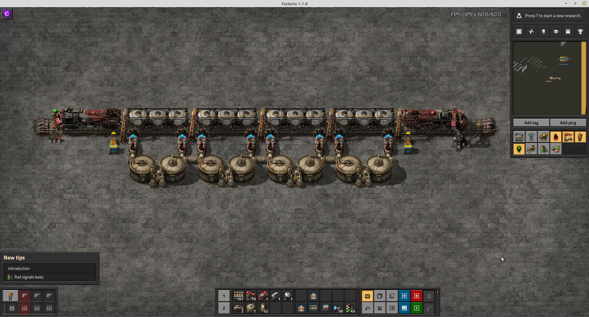

# Factorio - Train Station Blueprint Creator

[Live version here](https://burnysc2.github.io/Factorio-Train-Station-Blueprint-Creator/)

This website used to be a [mod](https://mods.factorio.com/mod/BurnysTSBC) which turned into a [website](https://burnysc2.github.io/Factorio/Tools/BurnysTSBC/) (so one could use it in a multiplayer server without having to install the mod on the server).

This website makes it easier to create large train stations for the game [Factorio](https://factorio.com/). 

## Features
- Load/unload for normal (inserter+chests) and fluid (pumps+storage tanks) stations
- Supports single and [double headed](https://forums.factorio.com/viewtopic.php?t=53937) trains
- Variable inserter types, belt types, chest types (use logistic chests for bot loading / unloading)
- Optional filter inserters (up to 5 resource types)
- Connect all chests / storage tanks with green / red wire
- Choice which side of the train stations should be used (left, right, both)
- Beltflow towards the front or back of the station
- [Chest limiting](https://wiki.factorio.com/Stack#Stack_limitation)
- Automatic locomotive refuel (with requester chests for fuel near locomotives)
- Automatic lamps, poles, and signal placement
- [Stackers](https://www.youtube.com/watch?v=x6-P74xYvYg) (vertical and diagonal): let trains wait in queue before using the station
- [Train limit per station](https://factorio.com/blog/post/fff-361)
- [Include train in the blueprint](https://www.factorio.com/blog/post/fff-263)

## Screenshots





## Development
### Requirements

- Node (npm)

### Updating the item list

Go to [this website](https://github.com/kevinta893/factorio-recipes-json) and download the `recipes.json` file. Place it in `src/constants/` as file `itemlist.json`.

### Start development mode
```
npm install
npm run start
```

### Build the project
```
npm run build
```

### Biome autoformatting
`npm run lint-format`
